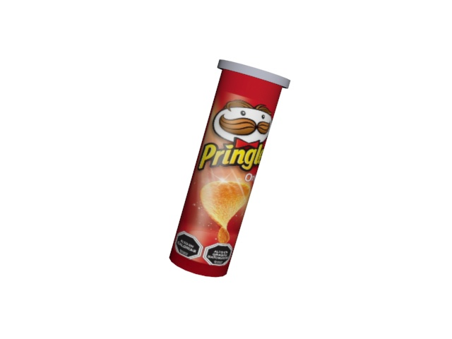

# Feature selection of dataset for Deep Learning and applications in computer vision.
### Jesus Eduardo Ortiz Sandoval
### Ferran Cancio Pujols
### Ph.D Student
### Universidad Tecnica Federico Santa Maria
---
En este trabajo se pretende establecer unas bases teóricas para el estudio de los datasets sinteticos en aplicaciones de deep learning, el dataset sintetico es generado a partir de un software de renderizado 3D (Adobe MAX 3DS con licencia estudiantil). A continuación podemos observar una imágen generada desde el software de renderizado 3D.

Esta imágen guarda una relación muy parecida con una foto real, ya que se hace una composición del modelamiento 3D del producto con una serie de 3000 fondos de supermercados.  
En total se obtienen 25.000 imagenes desde el software antes de comenzar a hacer el pre-procesamiento de la información.
Lo primero que vamos a realizar es la extracción de caracteristicas de estas imagenes, cada imagen con fondo controlado tiene su misma imagen (ubicación, rotación, iluminación) con fondo blanco, esto para poder realizar la segmentación para generar el dataset de entrenamiento para la aplicación de visión por computador.

Una vez que se tienen todas las bibliotecas que se pueden utilizar en nuestro programa el siguiente paso es extraer las caracteristicas de nuestra imagen respectiva, pero con fondo blanco.

Ahora vamos a aplicar ORB para poder extraer los parametros para el etiquetado de las imagenes.

En este primer segmento hacemos una extraccion de caracteristicas rapida con ORB, se determina que la base y la tapa del elemento no se determinan como puntos relevantes, la mayoria de los puntos relevantes se enuentran en la etiqueta de los productos. Esta herramienta se le aplica a la imagen con el tamaño modificado, vamos a ejecutar el mismo algoritmo en la imagen de tamaño real.

En la imagen de tamaño completo se determina que la etiqueta no es tan importante en las caracteristicas extraidas, pero si es relevante que detecta la tapa y la base, con este ejemplo podemos determinar facilmente los parametros *Xmin, Xmax, Ymin, Ymax* 

En este caso hemos podido determinar el boundingbox adecuado para nuestro elemento y crearle su etiqueta correspondiente, es importante destacar la velocidad de ejecución del algoritmo (aca debemos meter el tiempo). Ahora con los puntos que se encuentran para la imágen de tamaño real, se procede a dividir en 4 estos mismos puntos y ver si coinciden con el resize creado en el algoritmo.

Como se mantiene la relación lineal de las imagenes y de los puntos de interes efectivamente el etiquetado funciona de una manera correcta en la imagen procesada en el punto anterior, ahora se procede a extraer todas las caracteristicas de las imagenes del set de datos y guardarlas en un archivo **CSV**.
Los parametros que se le entregan a este archivo son los siguientes.
1. Nombre de archivo
2. Width
3. Height
4. Clase
5. Ymin
6. Ymax
7. Xmin
8. Xmax

En este punto se generaron los dos archivos **CSV** para la generación del set de datos con la utilidad TFRECORDS.
